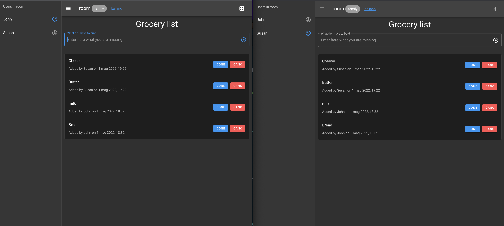

# Grocery List - Family Edition
An app to always keep the shopping list updated and synchronized in real time among all family members.




  - [Links](#links)
  - [Setup](#setup)
  - [Built with](#built-with)
  - [What I learned](#what-i-learned)
  - [References](#references)

## Links
- [Live Site URL](https://listadellaspesa.herokuapp.com/)

## Setup

You'll need Git and Node.js (which comes with npm) installed on your computer. From your command line:

```bash
# Clone the following repository
$ git clone https://github.com/StefanoFrontini/grocery-list-family.git

# Go into the repository
$ cd grocery-list-family

# Install dependencies
$ npm install

# Run the dev server
$ npm run dev
```
## Built with
- Vue
- Nuxt 2
- Node
- Socket.IO
- Vue-Socket.IO
- Vuetify
- MongoDB
## What I learned
I built this app to learn the Socket.IO protocol and backend development with Node and MondoDB

## References
- [Blog post](https://listadellaspesa.herokuapp.com/)
- [MongoDB tutorial](https://www.youtube.com/watch?v=vjf774RKrLc&t=2539s)


